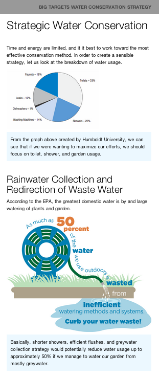

# Responsive Email Templates

Using free and open source software you can manage to send a formatted newsletter.

* Mozilla Thunderbird
* Zurb email templates
* Zurb inliner (or any foss css inliner)

## Run html through an Inliner for Gmail Compatibility

In order to have the responsive template work in gmail, you will need to run your source first through a CSS inliner:

http://zurb.com/ink/inliner.php

## Developed Examples

Find the original template from the Zurb Foundation website http://zurb.com/ink/

Below are additional examples for general use which demonstrate how to develop responsive emails with Zurb Ink:

<table>
  <tr>
  <td>
<h4>Simple, Extensible Header and Image template</h4>

 
<em>Just copy and paste tables to add additional topics.</em>
</td>
</tr>
</table>
